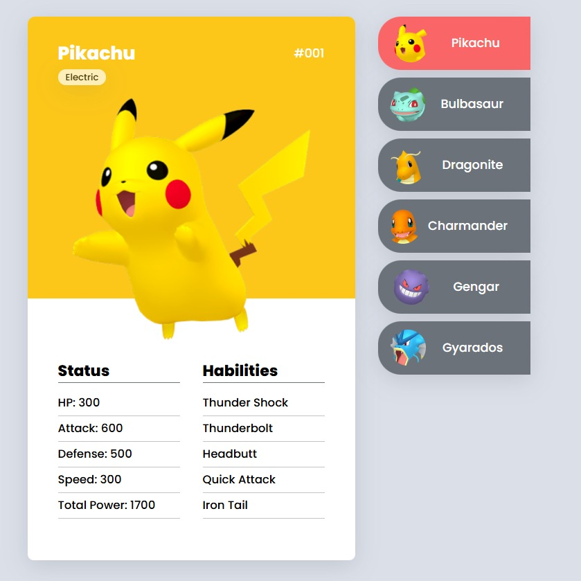

# **Mini-Pokedéx**
Este projeto é uma aplicação web que simula uma mini Pokédex, exibindo informações de Pokémon, como status, habilidades, e tipos. Ele foi desenvolvido com HTML, CSS e JavaScript.

## **Estrutura do Projeto**
A estrutura de diretórios do projeto é organizada da seguinte forma:

```bash
/mini-pokedéx
 ├── /src
 │   ├── /css
 │   │   ├── globals.css
 │   │   ├── cartao.css
 │   │   ├── lists.css
 │   │   └── responsive.css
 │   ├── /images
 │   ├── /js
 ├── index.html
 └── readme.md
 ```

## **Descrição dos Diretórios**

- /css: Contém os arquivos de estilo usados na aplicação.
- globals.css: Estilizações globais.
- cartao.css: Estilo para os cartões dos Pokémon.
- lists.css: Estilo da lista de Pokémon.
- responsive.css: Estilizações responsivas para melhor adaptação em dispositivos móveis.
- /images: Armazena as imagens utilizadas no projeto.
- /js: Contém os scripts JavaScript para manipulação de eventos e funcionalidades dinâmicas.
- index.html: Página principal do projeto.

## **Funcionalidades**

- Exibição de cartões detalhados de Pokémon com informações como:
- Nome e número de identificação.
- Tipo(s) do Pokémon.
- Imagem representativa.
- Status (HP, Ataque, Defesa, Velocidade e Poder Total).
- Habilidades disponíveis.
- Lista lateral interativa para navegar entre os Pokémon.
- Design responsivo para uma melhor experiência em diferentes dispositivos.

## **Design da Página**
O design da página segue uma abordagem moderna e intuitiva, com foco na exibição clara das informações.

### **Fontes e Ícones**

- Fonte utilizada: Poppins com pesos 300, 500 e 800.
- Ícones: Font Awesome.

## **Estrutura Visual**
Cartões de Pokémon:

Cada cartão apresenta o Pokémon com sua imagem e informações principais, divididas em duas seções e uma responsividade para adaptação a diversas telas:

1. Topo do Cartão: Nome, número, tipo e imagem do Pokémon. Informações Detalhadas: Status e habilidades.

2. Lista Lateral:
Uma lista de ícones e nomes dos Pokémon para navegar entre os diferentes cartões.

3. Responsividade: Adaptado para diferentes tamanhos de tela, garantindo uma boa experiência em dispositivos móveis e desktop.

## **Como Visualizar o Projeto**

```plaintext
1- Faça o download ou clone o repositório.
2- Abra o arquivo index.html no navegador de sua preferência.
3- Ou acesse: https://ricardovcastilho.github.io/mini-pokedex-devquest/
``` 

## **Prévia**

- Protótipo WEB:


- Protótipo Mobile:


